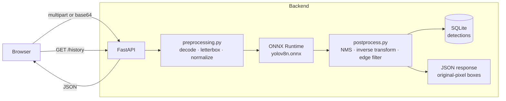

# detecto

Real-time person detection and counting system for monitoring spaces
(entrances, classrooms, warehouses). Upload an image, get back the number of
people, their bounding boxes, confidence scores, and processing time — plus a
filterable history of past detections.

**Stack:** FastAPI · React/Vite · YOLOv8n served through ONNX Runtime · SQLite.
**CPU-only.** No GPU required.

---

## Project status (honest)

| Area | State |
|------|-------|
| Backend API (`/detect`, `/history`, `/reset`, `/health`) | ✅ working |
| Frontend (Detection View, History View) | ✅ working |
| Model (`yolov8n.onnx`) | ✅ exported and verified |
| Smoke tests (`scripts/smoke.sh`) | ✅ 12 pass / 0 fail |
| Detection tuning (threshold + frame-edge filter) | ✅ measured and applied |
| Full benchmark + ground-truth counts | ⏳ pending (needs hand counts) |
| Screenshots | ⏳ pending |
| Results table | ⏳ placeholders below |

The sections marked ⏳ are deliberately left as placeholders — no benchmark
numbers have been invented. See [Results](#results).

---

## Architecture



### Request path and where latency goes

```
client ──HTTP──▶ decode image ──▶ letterbox to 640² ──▶ model inference
                                                        (~140 ms on CPU)
      ◀──JSON── encode boxes ◀── NMS + inverse transform ◀──┘
```

- **Dominant cost:** model inference (~140 ms measured on an Intel i5-7300U).
- Decode, letterbox, NMS, and the coordinate transform are all sub-10 ms.
- `inference_time_ms` is timed **separately** from `total_time_ms` so the
  headline metric is not polluted by I/O.

### The coordinate transform (the #1 bug source)

The model only ever sees a **letterboxed** `640×640` square. Boxes returned by
the model are in that square's coordinates and must be mapped back to the
**original image pixels** before they leave the API:

```
forward:  x_letterboxed = x_original * scale_x + pad_w
inverse:  x_original    = (x_letterboxed - pad_w) / scale_x
```

The backend owns this transform; the frontend only scales original-pixel boxes
to its display size. A round-trip test confirms **0.000 px error** across wide,
tall, square, and HD inputs.

---

## Repository structure

```
detecto/
├── backend/
│   ├── main.py                 # app, lifespan model load, CORS, error envelope
│   ├── routes/
│   │   ├── detect.py           # POST /detect  (multipart + base64)
│   │   └── history.py          # GET /history, DELETE /reset
│   ├── models/record.py        # Pydantic schemas + SQLite repository
│   ├── utils/preprocessing.py  # decode, letterbox, NMS, inverse transform
│   ├── samples/                # 14 demo images (COCO val2017)
│   └── weights/                # yolov8n.onnx (gitignored)
├── frontend/
│   ├── public/samples/         # same 14 demo images
│   └── src/
│       ├── components/         # ImageUpload, BoxOverlay, DetectionPanel, ...
│       ├── pages/              # DetectionPage, HistoryPage
│       ├── api.js              # fetch client + error handling
│       └── App.jsx
├── scripts/
│   ├── smoke.sh                # curl tests for every endpoint
│   ├── benchmark.py            # accuracy / timing metrics
│   └── export_model.py         # one-time YOLOv8n -> ONNX export
├── tests/ground_truth.csv      # hand-counted ground truth
├── docs/PLAN.md                # decisions log + build plan
├── requirements.txt
└── .env.example
```

---

## Setup

### Prerequisites

- Python 3.12
- Node 18+ (tested on Node 22)
- No sudo required; everything installs into a local venv.

### 1. Backend

```bash
python3 -m venv .venv
.venv/bin/pip install -r requirements.txt
cp .env.example .env
```

### 2. Model

The runtime deliberately does **not** depend on PyTorch (it is ~2.5 GB and
would not fit the target machine). The ONNX model must be exported once on a
machine that has PyTorch — the free option is Google Colab:

```python
!pip install -q ultralytics
from ultralytics import YOLO
from google.colab import files
YOLO("yolov8n.pt").export(format="onnx", opset=12, imgsz=640, nms=False)
files.download("yolov8n.onnx")
```

Place the downloaded file at `backend/weights/yolov8n.onnx` (~13 MB).

> **Common trap:** GitHub does **not** host `yolov8n.onnx`. Downloading from a
> web page saves HTML, not a model. The backend now detects this and logs a
> clear message instead of failing cryptically.

The export helper is also available as `scripts/export_model.py`.

### 3. Run the backend

```bash
.venv/bin/uvicorn backend.main:app --reload --host 127.0.0.1 --port 8000
```

- API docs: <http://127.0.0.1:8000/docs>
- Health: <http://127.0.0.1:8000/health> → `"model_loaded": true`

> Keep the port consistent. The frontend defaults to `http://localhost:8000`;
> if you use another port, start the frontend with
> `VITE_API_BASE_URL=http://localhost:<port>`.

### 4. Frontend

```bash
cd frontend
npm install
npm run dev
```

Open <http://localhost:5173>. The backend's `CORS_ORIGINS` already allows this
origin.

---

## Configuration

All settings come from environment variables (`.env`), with safe defaults in
code. See `.env.example` for the full annotated list.

| Variable | Default | Purpose |
|----------|---------|---------|
| `MODEL_PATH` | `weights/yolov8n.onnx` | ONNX model (relative to `backend/`) |
| `IMG_SIZE` | `640` | Model input resolution |
| `CONF_THRESHOLD` | `0.25` | Minimum confidence to count as a person |
| `NMS_IOU_THRESHOLD` | `0.6` | NMS de-duplication threshold |
| `MAX_EDGE_CLIP_FRACTION` | `0.3` | Drop people cut off by the frame (`1.0` disables) |
| `PERSON_CLASS_ID` | `0` | COCO class index for "person" |
| `MAX_UPLOAD_MB` | `10` | Upload size cap (HTTP 413 above this) |
| `DB_PATH` | `data/detecto.db` | SQLite database |
| `CORS_ORIGINS` | `http://localhost:5173` | Comma-separated allowed origins |
| `ORT_NUM_THREADS` | `4` | ONNX Runtime CPU threads |

---

## API reference

| Method | Path | Description |
|--------|------|-------------|
| `POST` | `/detect` | Detect people in an image |
| `GET` | `/history` | Past detections, filterable |
| `DELETE` | `/reset` | Clear all stored detections (destructive) |
| `GET` | `/health` | Liveness + model-loaded flag |

`POST /detect` accepts **either** `multipart/form-data` (field `file`) **or**
`application/json` (`{"image_base64": "..."}`), with an optional
`?annotated=true` query parameter to include a base64 PNG with boxes drawn.

```bash
# multipart
curl -X POST http://localhost:8000/detect \
  -F "file=@backend/samples/000000078748.jpg"

# base64
curl -X POST http://localhost:8000/detect \
  -H "Content-Type: application/json" \
  -d "{\"image_base64\":\"$(base64 -w0 backend/samples/000000078748.jpg)\"}"

# history, filtered
curl "http://localhost:8000/history?min_confidence=0.5&time_start=08:00&time_end=18:00"

# clear
curl -X DELETE http://localhost:8000/reset
```

**Response (`/detect`):**

```json
{
  "person_count": 11,
  "boxes": [{"x1": 95.3, "y1": 16.8, "x2": 202.1, "y2": 115.0, "confidence": 0.89}],
  "avg_confidence": 0.58,
  "inference_time_ms": 139.5,
  "total_time_ms": 168.2,
  "image_width": 640,
  "image_height": 480,
  "annotated_image_base64": null
}
```

Boxes are in **original image pixel coordinates**. Errors use one envelope:

```json
{"error": {"code": "unsupported_format", "message": "...", "detail": "..."}}
```

---

## Testing methodology

### Evaluation metrics

For each image, comparing the model's count to a **hand-counted** ground truth:

```
TP = min(detected, truth)          # matched people
FP = max(0, detected - truth)      # spurious detections
FN = max(0, truth - detected)      # missed people

Detection accuracy   = ΣTP / Σtruth          × 100   (target ≥ 85 %)
False-positive rate  = ΣFP / Σdetected       × 100   (target ≤ 10 %)
Mean inference time  = mean(inference_time_ms)        (target ≤ 1.5 s)
Mean confidence      = mean of all returned box confidences (target ≥ 0.70)
Reliability          = images processed without error / total × 100 (target 100 %)
```

> **Metric conflict, stated honestly.** Detection accuracy and mean confidence
> pull in opposite directions on crowded images: counting more people requires
> accepting lower-confidence detections, which lowers the mean. We measured
> this tradeoff and documented it in `docs/PLAN.md` (decisions D10/D11).

### Sample set

14 images from **COCO val2017**, chosen to be adversarial rather than
flattering:

| Category | Count | Example |
|----------|-------|---------|
| Zero-person control | 1 | empty kitchen |
| Single subject (close / distant) | 2 | |
| Small groups (2–4) | 4 | |
| Medium / large groups (5–15) | 4 | |
| Crowd (dense) | 2 | street market |
| Occlusion (overlapping boxes) | 1 | skiers |
| Partial visibility (frame edge) | 1 | |
| Poor lighting | 1 | dark scene (mean brightness ≈ 51) |

Sources and licences are recorded in `tests/ground_truth.csv`. Images are
copied to both `backend/samples/` and `frontend/public/samples/`.

### How to run

```bash
# 1. backend must be running
bash scripts/smoke.sh          # endpoint + error-path checks

# 2. fill manual_count in tests/ground_truth.csv first
.venv/bin/python scripts/benchmark.py
```

`benchmark.py` refuses to run until `manual_count` is filled — it will not
substitute the COCO annotation counts, because ground truth must be human.

---

## Results

> ⏳ **Pending.** The full benchmark has not been run yet because the
> hand-counted ground truth (`tests/ground_truth.csv`) is not filled in.
> **No numbers below are fabricated** — measured facts are labelled as such.

### Measured so far (real, not placeholders)

| Fact | Value |
|------|-------|
| Model input / output contract | `[1,3,640,640]` → `[1,84,8400]` |
| Inference time (i5-7300U, 2 cores) | ~140 ms per 640² image |
| Coordinate round-trip error | 0.000 px |
| Smoke tests | 12 pass / 0 fail |
| Sample #3 (crowd) before tuning | 7 people detected |
| Sample #3 (crowd) after tuning | 13, then 11 after the frame-edge filter |
| Zero-person control | 0 detections at every threshold down to 0.1 |

### Benchmark table (to be filled from `scripts/benchmark.py`)

| Metric | Value | Target | Status |
|--------|-------|--------|--------|
| Detection accuracy | _TBD_ | ≥ 85 % | ⏳ |
| False-positive rate | _TBD_ | ≤ 10 % | ⏳ |
| Mean inference time | _TBD_ (~140 ms expected) | ≤ 1.5 s | ⏳ |
| Mean confidence | _TBD_ (~0.59 at conf 0.25) | ≥ 0.70 | ⏳ |
| Reliability | _TBD_ (12/12 smoke) | 100 % | ⏳ |

### Screenshots

> ⏳ Placeholder — capture these after running the app:
>
> | View | File |
> |------|------|
> | Detection View with boxes | `docs/screenshots/detection.png` |
> | Results panel (count / confidence / timing) | `docs/screenshots/panel.png` |
> | History View (chart + table) | `docs/screenshots/history.png` |

---

## Design decisions

The full decisions log is in [`docs/PLAN.md`](docs/PLAN.md). The headline calls:

- **ONNX Runtime, not PyTorch** — same YOLOv8n model, ~400 MB instead of
  ~2.5 GB, so it fits a no-sudo, low-disk machine.
- **Backend owns the coordinate transform** — single source of truth; the
  frontend only scales original-pixel boxes.
- **Inline SVG for boxes** (not canvas/divs) — `viewBox` set to the original
  pixel dimensions means the browser handles all scaling, so boxes stay sharp
  at any size with no manual scale math.
- **Filtering in SQL** — hundreds of rows, indexed columns, one authoritative
  result set drives both the chart and the table.
- **`CONF_THRESHOLD=0.25`** (brief suggested 0.5) — measured to recover
  occluded/small people in crowds with no false-positive cost on easy images.
- **Frame-edge filter** — people cut off by the frame are excluded, with a
  shape test that keeps close-up subjects.

---

## What worked well

- **The coordinate transform.** Building the inverse transform first, with a
  round-trip test across aspect ratios, meant zero box-alignment bugs later.
- **ONNX Runtime.** Cold model load is fast, inference is ~140 ms, and the
  install is small enough for constrained hardware.
- **Separating inference time from total time.** Made the headline metric
  trustworthy.
- **The smoke suite.** It caught two real bugs: a validation-order flaw
  (bad input returned 503 instead of 400) and a corrupt PNG fixture.
- **Lowering the confidence threshold.** Recovered crowd counts from ~half to
  near-correct with no measured false positives on easy images.

## What could be improved

- **Small/distant people are still undercounted.** Threshold tuning cannot fix
  this; higher input resolution (re-export at 1280) or tiled inference (SAHI)
  would, at ~4× the inference cost.
- **The metric conflict is unresolved.** Mean confidence drops below 0.70 when
  the threshold is low enough to count crowds. Higher resolution would raise
  both together.
- **Exact crowd counting is an open problem.** Even COCO's own annotations
  disagree with a careful human count on the dense images.
- **No video/webcam support yet.** Bonus features (webcam, region alerts, CSV
  export, hourly stats) are planned in `docs/PLAN.md`.
- **Frontend bundle is ~560 KB** (Recharts dominates); code-splitting would
  shrink it.

---

## License

Apache License 2.0 — see [LICENSE](LICENSE).
